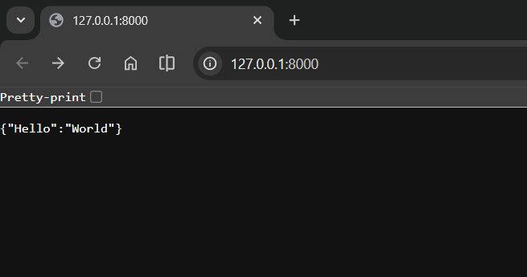
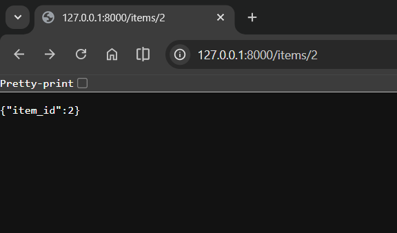
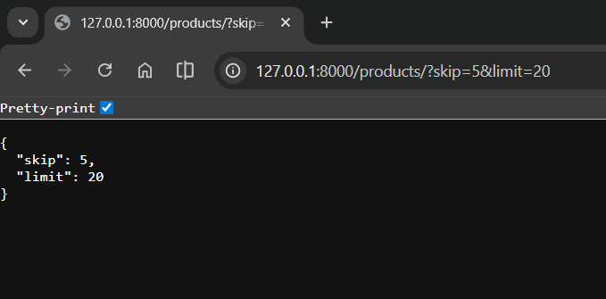

# FastAPI Basics Tutorial

## 1. Creating Your First FastAPI Application

Whenever we create a FastAPI application, we need to import the FastAPI library and create an instance of the FastAPI class. This instance is the core of your application:

```python
from fastapi import FastAPI

app = FastAPI()
```

The `app` variable holds the FastAPI application instance and is used to define all your routes and endpoints.

## 2. Understanding the @app.get() Decorator

The `@app.get()` is a **route decorator** that tells FastAPI how to handle HTTP GET requests.

### How It Works

```python
@app.get("/")
def read_root():
    return {"Hello": "World"}
```

Breaking it down:

- `@app.get("/")` tells FastAPI: "When an HTTP GET request comes to the path `/`, use the function below."
- The `@...` decorator syntax attaches routing rules to the function it decorates (`read_root` in this case).
- When a client visits `/` with a GET request, FastAPI automatically calls `read_root()` and returns its result as JSON: `{"Hello": "World"}`.
- **Important**: `@app.get()` does NOT call your function immediately. It **registers** the function as an endpoint in FastAPI's routing table.

### Testing the Basic Route

Run your application using the terminal:

```shell
uvicorn main:app --reload
```

Then open the URL `http://127.0.0.1:8000` in your browser:


## 3. Running Your App Automatically with Python

Instead of using the `uvicorn` command every time, you can make your file executable with a single command. Add these lines to the bottom of your main.py file:

```python
if __name__ == "__main__":
    uvicorn.run("main:app", host="127.0.0.1", port=8000, reload=True)
```

Now you can simply run:

```shell
python main.py
```

**Note**: Make sure to install uvicorn first: `pip install uvicorn`

## 4. Path Parameters: Passing Arguments in the URL

FastAPI allows you to capture dynamic values from the URL path. These are called **path parameters**.

```python
@app.get("/items/{item_id}")
def read_item(item_id: int):
    return {"item_id": item_id}
```

When you visit `http://127.0.0.1:8000/items/2`, FastAPI:
1. Extracts `2` from the URL path
2. Validates it as an integer
3. Passes it to the `item_id` parameter
4. Returns the result:



## 5. Query Parameters: Multiple Values with Defaults

**Query parameters** are values passed after the `?` in the URL. They have default values and are optional:

```python
@app.get("/products/")
def list_products(skip: int = 0, limit: int = 10):
    return {"skip": skip, "limit": limit}
```

This is a **pagination pattern** commonly used for:
- **skip**: how many records to skip from the start
- **limit**: how many records to return

### Examples:
- `http://127.0.0.1:8000/products/` → Returns first 10 products (default values)
- `http://127.0.0.1:8000/products/?skip=5&limit=20` → Skips 5, returns 20 products

Result:


