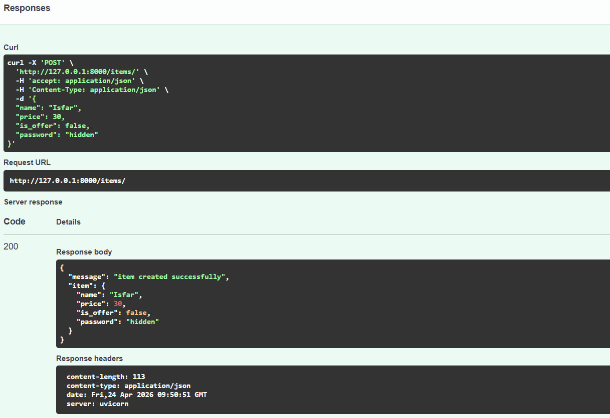
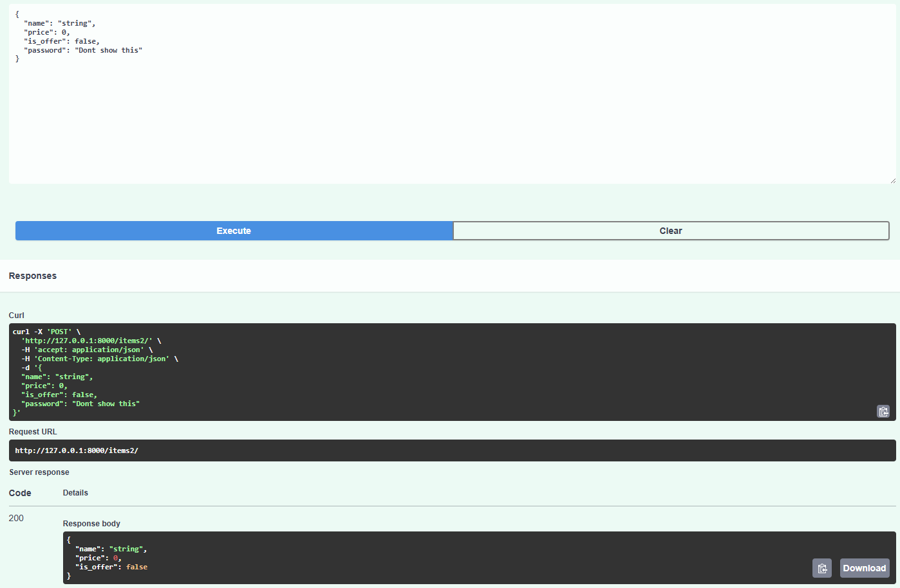
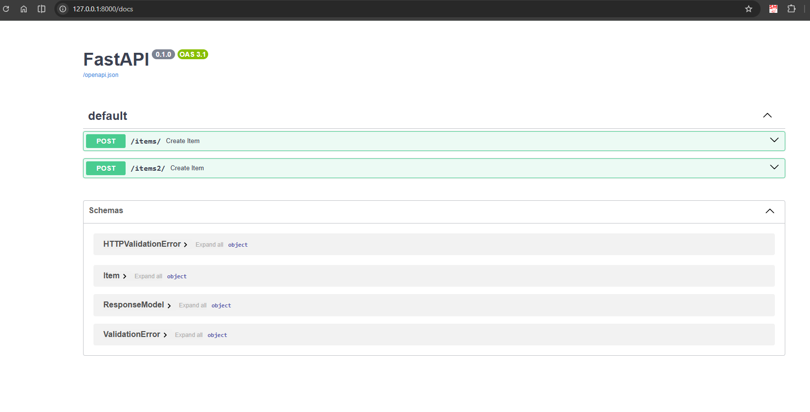

# Pydantic Tutorial for FastAPI

## Overview

Pydantic is a powerful data validation and parsing library that integrates seamlessly with FastAPI. It ensures that incoming data matches expected types and formats, while also providing automatic documentation. This tutorial covers all essential Pydantic concepts from basic models to advanced validation techniques.

---

## 1. What is Pydantic?

Pydantic is a Python library that:

- **Validates data types** - ensures data matches the declared types
- **Provides default values** - makes fields optional with sensible defaults
- **Generates API documentation** - auto-generates OpenAPI/Swagger docs
- **Handles type coercion** - converts compatible types automatically
- **Creates structured responses** - controls what data is returned to clients

### Why Use Pydantic with FastAPI?

```python
from pydantic import BaseModel

class Item(BaseModel):
    name: str
    price: float
    is_available: bool = True
```

This single definition:
✅ Validates request body  
✅ Converts JSON to Python objects  
✅ Generates Swagger documentation  
✅ Ensures type safety

---

## 2. Basic Pydantic Models

### Creating a Simple Model

```python
from pydantic import BaseModel

class Person(BaseModel):
    """
    Basic Pydantic model with required fields.
    All fields are required by default.
    """
    name: str
    age: int
    married: bool
```

**Key Points:**

- All fields without defaults are **required**
- Type hints (`str`, `int`, `bool`) define field types
- Pydantic validates these types automatically

### Models with Default Values

```python
class Person1(BaseModel):
    name: str
    age: int
    married: bool = False  # Optional, defaults to False
```

When `married` has a default value, it becomes **optional** in the API request.

---

## 3. Advanced Field Validation with Field()

### Using Field for Constraints

```python
from pydantic import BaseModel, Field
from typing import Annotated

class Person2(BaseModel):
    """
    Uses Field() for advanced validation constraints.
    """
    name: str = Field(..., min_length=1, max_length=50)
    age: int = Field(..., ge=0)  # greater than or equal to 0
    married: bool = Field(default=False)
```

**Common Field Constraints:**

- `min_length` / `max_length` - string length constraints
- `ge` / `le` - greater/less than or equal (≥, ≤)
- `gt` / `lt` - greater/less than (>, <)
- `pattern` - regex pattern matching
- `description` - for API documentation
- `...` (Ellipsis) - means required field

### Using Annotated for Clean Syntax

```python
from typing import Annotated, List, Dict, Optional

class Person4(BaseModel):
    """
    Uses Annotated for combining type hints with Field validation.
    This is the modern, cleaner approach.
    """
    name: Annotated[str, Field(..., min_length=1, max_length=50,
                               description="The person's name")]
    age: Annotated[int, Field(..., ge=0,
                             description="The person's age")]
    hobbies: Annotated[List[str], Field(default_factory=list,
                                        description="List of hobbies")]
    contract: Annotated[Dict[str, str], Field(default_factory=dict,
                                              description="Contract details")]
    married: Annotated[bool, Field(default=False)]
```

**Key Differences:**

- `default_factory` for mutable types (list, dict) - creates new instance each time
- `default` for immutable types (str, int, bool)
- `Annotated` keeps type hints and validation together

### Optional Fields

```python
class Person5(BaseModel):
    name: Annotated[str, Field(..., min_length=1, max_length=50)]
    age: Annotated[int, Field(..., ge=0)]
    earning: Optional[Annotated[float, Field(gt=0)]] = None
```

`Optional[Type]` means the field can be `Type` or `None`. It's truly optional - can be omitted entirely.

### Strict Type Validation

```python
class Person6(BaseModel):
    age: Annotated[int, Field(..., ge=0, strict=True)]
```

- `strict=True` only accepts actual integers (not "5" or 5.0)
- Without strict, Pydantic tries to coerce compatible types
- Useful when you need exact type matching

---

## 4. Field Validators

Field validators allow you to **customize validation logic** for specific fields.

### Basic Field Validator

```python
from pydantic import BaseModel, field_validator, EmailStr

class Person(BaseModel):
    name: str
    age: int
    email: EmailStr  # Built-in email validation
    married: bool

    @field_validator("name")
    @classmethod
    def upper_name(cls, v: str) -> str:
        """Convert name to uppercase"""
        return v.upper()

    @field_validator('name')
    @classmethod
    def validate_name(cls, v: str) -> str:
        """Ensure name is not empty"""
        if not v:
            raise ValueError('Name must not be empty')
        return v
```

**How It Works:**

1. `@field_validator("name")` targets the `name` field
2. Runs **after** type validation
3. Receives the validated value
4. Can **transform** (return modified value) or **reject** (raise ValueError)
5. Applied in order of definition

### Domain-Specific Email Validation

```python
@field_validator('email')
@classmethod
def validate_email(cls, v: EmailStr) -> EmailStr:
    """Only allow emails from specific domains"""
    allowed_domains = ['example.com', 'test.com']
    domain = v.split('@')[-1]  # Extract domain from email
    if domain not in allowed_domains:
        raise ValueError(f'Email domain must be one of: {allowed_domains}')
    return v
```

### Pre-Validation Processing with mode="before"

```python
@field_validator('name', mode="before")
@classmethod
def validate_name_before(cls, v: str) -> str:
    """Run before type coercion"""
    if not v:
        raise ValueError('Name must not be empty')
    return v
```

- `mode="before"` runs before type validation
- `mode="after"` (default) runs after type validation
- Use "before" for pre-processing (trimming, cleaning)

---

## 5. Model Validators

Model validators validate **relationships between multiple fields**.

### Cross-Field Validation

```python
from pydantic import BaseModel, field_validator, model_validator

class Person(BaseModel):
    name: str
    age: int
    email: EmailStr = None
    married: bool

    @field_validator("name")
    @classmethod
    def upper_name(cls, v: str) -> str:
        return v.upper()

    @model_validator(mode="after")
    def validate_both(self):
        """Validate relationships between fields"""
        if self.age > 60 and self.email is None:
            raise ValueError("Elderly users must provide a backup email")
        return self
```

**When to Use:**

- Validating multiple fields together
- Business logic that spans multiple fields
- Conditional requirements (e.g., "if age > 60, then email is required")

---

## 6. Computed Fields

Computed fields are **derived values calculated from other fields**.

### BMI Calculation Example

```python
from pydantic import BaseModel, computed_field

class HealthProfile(BaseModel):
    name: str
    age: int
    height: float  # in meters
    weight: float  # in kg

    @computed_field
    @property
    def bmi(self) -> float:
        """BMI = weight / (height ^ 2)"""
        return self.weight / (self.height ** 2)
```

**How It Works:**

- Defined as a `@property` method
- Decorated with `@computed_field`
- Calculated on-the-fly when accessed
- Included in JSON responses
- Not part of input validation (input only)

**Example:**

```json
{
  "name": "John",
  "age": 30,
  "height": 1.75,
  "weight": 70,
  "bmi": 22.86 // Automatically calculated
}
```

---

## 7. Nested Models

Nested models represent **complex data structures** where models contain other models.

### Creating Nested Models

```python
from pydantic import BaseModel

class Address(BaseModel):
    city: str
    road: str
    building_no: str

class Person(BaseModel):
    name: str
    age: str
    address: Address  # Address is nested inside Person
```

**Benefits:**

- Organize complex data logically
- Reuse models across different endpoints
- Automatic validation of nested data
- Clear, structured API contracts

**Example Request:**

```json
{
  "name": "John",
  "age": "30",
  "address": {
    "city": "New York",
    "road": "5th Avenue",
    "building_no": "42"
  }
}
```

---

## 8. Using Pydantic Models in FastAPI

### Basic POST Endpoint

```python
from fastapi import FastAPI
from pydantic import BaseModel

app = FastAPI()

class Item(BaseModel):
    name: str
    price: float
    is_offer: bool = False
    password: str = "Dont show this"  # Sensitive field

@app.post("/items/")
def create_item(item: Item):
    return {
        "message": "item created successfully",
        "item": item
    }
```

**What Happens:**

1. FastAPI receives JSON request
2. Pydantic validates against `Item` model
3. If valid → calls `create_item()` with `item` object
4. If invalid → returns 422 error with details
5. Response includes the `password` field (security issue!)

### Response Model: Controlling What Gets Returned

```python
class ResponseModel(BaseModel):
    """Only these fields are returned to the client"""
    name: str
    price: float
    is_offer: bool = False
    # Note: password is NOT here!

@app.post("/items2/", response_model=ResponseModel)
def create_item(item: Item):
    return item
```

**Benefits:**

- **Security**: Hide sensitive fields like passwords, tokens
- **Clean API**: Return only necessary data
- **Documentation**: Shows client exactly what they'll receive
- **Validation**: Validates response matches the schema

**Behavior:**

- Request includes `password` ✅
- Response EXCLUDES `password` ✅
- Swagger docs show `ResponseModel` structure ✅

---

## 9. Complete main.py Walkthrough

### Full Code Example

```python
from pydantic import BaseModel
from fastapi import FastAPI
import uvicorn

app = FastAPI()

# Define what clients send us
class Item(BaseModel):
    name: str
    price: float
    is_offer: bool = False
    password: str = "Dont show this"

# Define what we send back (without password)
class ResponseModel(BaseModel):
    name: str
    price: float
    is_offer: bool = False

# Endpoint 1: Returns everything including password
@app.post("/items/")
def create_item(item: Item):
    return {
        "message": "item created successfully",
        "item": item
    }
    # Response:
    # {
    #   "message": "item created successfully",
    #   "item": {
    #     "name": "...",
    #     "price": ...,
    #     "is_offer": ...,
    #     "password": "Dont show this"  ⚠️ Security issue!
    #   }
    # }

# Endpoint 2: Returns only public data
@app.post("/items2/", response_model=ResponseModel)
def create_item(item: Item):
    return item
    # Response:
    # {
    #   "name": "...",
    #   "price": ...,
    #   "is_offer": ...
    # }  ✅ Password is hidden!

if __name__ == "__main__":
    uvicorn.run(app, host="127.0.0.1", port=8000)
```

### How the Endpoints Work

#### Endpoint 1: `/items/` (POST)



**Request (what client sends):**

```json
{
  "name": "Laptop",
  "price": 999.99,
  "is_offer": true,
  "password": "admin123"
}
```

**Processing:**

1. FastAPI validates JSON against `Item` model
2. Checks: `name` is string ✅, `price` is float ✅, `is_offer` is bool ✅
3. Creates `Item` object with all fields
4. Calls `create_item(item)` function

**Response (without response_model):**

```json
{
  "message": "item created successfully",
  "item": {
    "name": "Laptop",
    "price": 999.99,
    "is_offer": true,
    "password": "admin123" // ⚠️ Exposed!
  }
}
```

#### Endpoint 2: `/items2/` (POST with response_model)



**Request (same as above):**

```json
{
  "name": "Laptop",
  "price": 999.99,
  "is_offer": true,
  "password": "admin123"
}
```

**Processing:**

1. FastAPI validates JSON against `Item` model ✅
2. Calls `create_item(item)` function
3. **BEFORE returning**, validates response against `ResponseModel`
4. Strips out fields not in `ResponseModel` (removes `password`)

**Response (with response_model):**

```json
{
  "name": "Laptop",
  "price": 999.99,
  "is_offer": true
}
```

✅ Password is **never** sent to client!

---

## 12. Testing the Endpoints

### Using cURL

```bash
# Test /items/ endpoint (shows password)
curl -X POST "http://127.0.0.1:8000/items/" \
  -H "Content-Type: application/json" \
  -d '{"name":"Laptop","price":999.99,"is_offer":true,"password":"secret"}'

# Test /items2/ endpoint (hides password)
curl -X POST "http://127.0.0.1:8000/items2/" \
  -H "Content-Type: application/json" \
  -d '{"name":"Laptop","price":999.99,"is_offer":true,"password":"secret"}'
```

### Using Swagger UI

Navigate to `http://127.0.0.1:8000/docs` after running the server:



- Click "Try it out" on each endpoint
- Enter test data
- See request/response examples
- View automatic validation error messages

---
