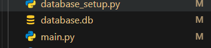
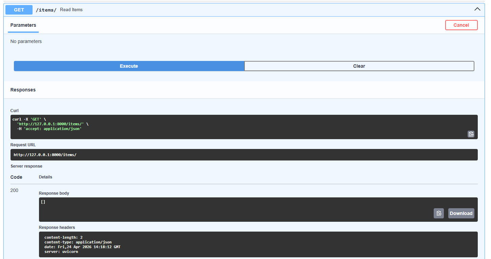
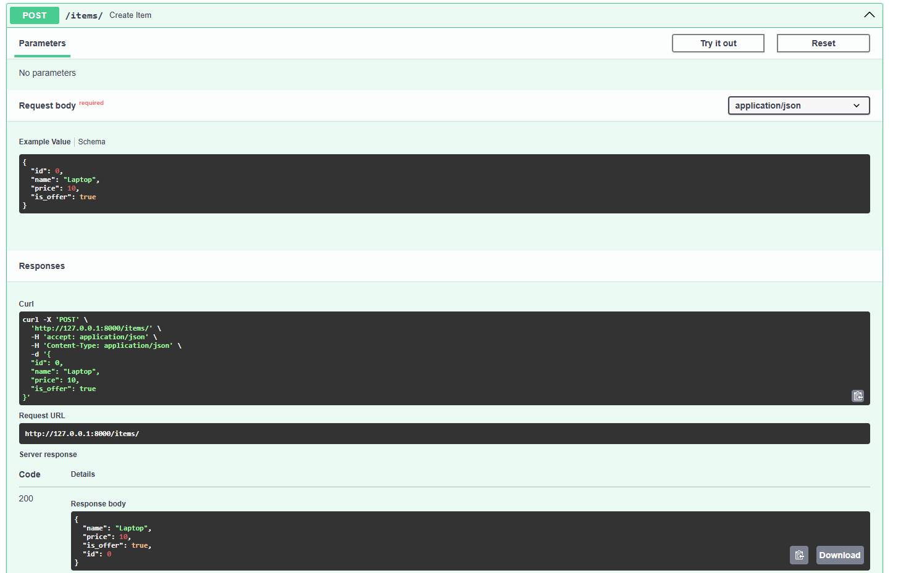
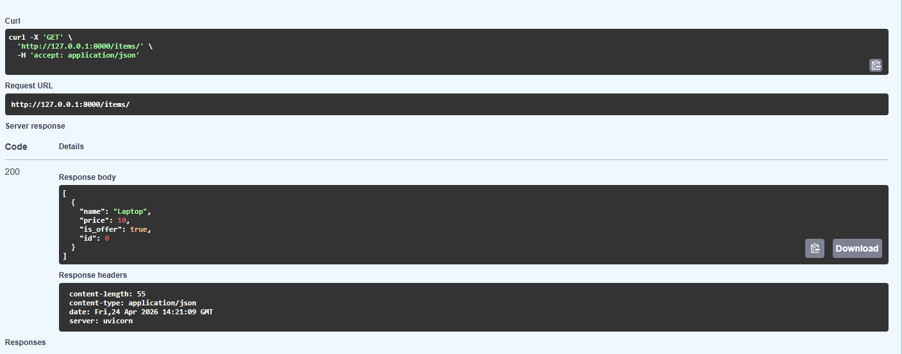

# Tutorial: Connecting FastAPI to SQLite Database

## Overview

This tutorial teaches you how to connect a FastAPI application to a SQLite database using **SQLModel**, which is a modern library that combines the power of SQLAlchemy and Pydantic. We'll build a complete Item API that can create and retrieve items from a SQLite database stored locally in your project folder.

### Key Concepts

If you're new to databases, here's how the pieces fit together:

```
User sends JSON request
        ↓
FastAPI validates against Item model (Pydantic)
        ↓
Item object is created
        ↓
SQLModel maps it to a database table row
        ↓
SQLite stores it in database.db file (local file)
        ↓
FastAPI returns the item with auto-generated ID
```

## Project Structure

```
03-Connecting-To-SQLite/
├── database_setup.py    # Database configuration and table models
├── main.py              # FastAPI application with endpoints
├── database.db          # SQLite database file (created on first run)
└── README.md            # This file
```

---

## The Complete Workflow: How It Works

### Step 0: Database File Creation

When you run the app for the first time, the database file is automatically created in your project folder:



The `database.db` file is where SQLite stores all your data. It's a single file that acts as the entire database.

### Step 1: Start with Empty Items

When you first run the server and visit the `/items/` endpoint, the database is empty:



**Response:**

```json
[]
```

This empty list means no items have been created yet.

### Step 2: Create an Item (POST Request)

Now we send a POST request to create a new item. Notice what we send and what we get back:



**Request Body (what we send):**

```json
{
  "name": "Laptop",
  "price": 10,
  "is_offer": true
}
```

**Notice:** We DON'T send an `id` - SQLite auto-generates it!

**Response (what we get back):**

```json
{
  "id": 0,
  "name": "Laptop",
  "price": 10,
  "is_offer": true
}
```

The database automatically created `id: 0` for us!

### Step 3: Retrieve Saved Items (GET Request)

Now when we call GET `/items/`, the data is there:



**Response:**

```json
[
  {
    "id": 0,
    "name": "Laptop",
    "price": 10,
    "is_offer": true
  }
]
```

The item was persisted to the database!

---

## How This All Works Together

**Timeline of what happens:**

1. **Server starts** → Lifespan context manager runs → Database tables created
2. **Client sends POST** → FastAPI validates JSON → Item stored in database
3. **Client sends GET** → SQLModel queries database → Returns all items as JSON
4. **Server shuts down** → Lifespan cleanup runs (closes connections)

---

## Code Breakdown

## Step 1: Database Setup (`database_setup.py`)

This file configures the database and defines the Item table. Let's go through it line by line:

#### Imports

```python
from sqlmodel import Field, SQLModel, create_engine
from typing import Optional
import os
```

- `Field` - Defines column properties (primary keys, default values, constraints)
- `SQLModel` - Base class for database models (combines SQLAlchemy + Pydantic)
- `create_engine` - Creates the database connection
- `Optional` - Allows fields to be None (from Python typing)
- `os` - For getting the current file directory (ensures database is created in the right place)

#### Define the Item Model

```python
class Item(SQLModel, table=True):
    id: Optional[int] = Field(
        default=None,
        primary_key=True,
        sa_column_kwargs={"autoincrement": True}  # AUTO-INCREMENT ENABLED
    )
    name: str
    price: float
    is_offer: bool = False
```

**What this does:**

- Creates a Python class that maps to a database table
- `table=True` tells SQLModel to create an actual database table
- Each field becomes a database column

**Breaking down each field:**

| Field      | Type            | Purpose           | Notes                                                                                                                        |
| ---------- | --------------- | ----------------- | ---------------------------------------------------------------------------------------------------------------------------- |
| `id`       | `Optional[int]` | Unique identifier | `primary_key=True` makes it the main ID; `sa_column_kwargs={"autoincrement": True}` makes database generate it automatically |
| `name`     | `str`           | Item name         | Required field (no default)                                                                                                  |
| `price`    | `float`         | Item price        | Required field (no default)                                                                                                  |
| `is_offer` | `bool`          | Is this on offer? | Optional with `False` as default                                                                                             |

**Why `sa_column_kwargs={"autoincrement": True}`?**

This is the KEY to automatic ID generation:

- Tells SQLite to automatically generate the next ID (0, 1, 2, 3, ...)
- Without this, you would have to manually provide an ID with each POST request
- With this, you just send the other fields and the database handles ID creation
- `sa_column_kwargs` is SQLAlchemy (the database toolkit) configuration

**Why `Optional[int]` for id?**

- When you create a new item, you don't provide an ID
- The database generates it automatically when you insert
- So it starts as None, then gets populated
- Without Optional, FastAPI would require you to provide an ID (defeating the purpose of auto-generation!)

#### Database Configuration

```python
current_dir = os.path.dirname(os.path.abspath(__file__))
sqlite_file_name = os.path.join(current_dir, "database.db")
sqlite_url = f"sqlite:///{sqlite_file_name}"
```

**Why this matters:**

❌ **Wrong:** `sqlite_file_name = "database.db"`  
This creates the file in whatever directory you run the script from (hard to find!)

✅ **Right:** Using `os.path.dirname(os.path.abspath(__file__))`  
This creates the file in the same folder as your Python script (easy to find!)

**Breaking it down:**

- `os.path.abspath(__file__)` - Gets the absolute path to the current file
- `os.path.dirname(...)` - Gets just the directory part
- `os.path.join(...)` - Safely joins paths (works on Windows and Mac/Linux)
- Result: `database.db` created right next to `database_setup.py`

#### Create the Engine

```python
engine = create_engine(sqlite_url, echo=True)
```

The engine is like a factory that creates connections to the database:

- `sqlite_url` - Where the database is located
- `echo=True` - Prints all SQL commands to console (great for learning!)
  - Set to `False` in production to reduce console noise

#### Create Tables Function

```python
def create_db_and_tables():
    SQLModel.metadata.create_all(engine)
```

**What it does:**

- Creates all database tables if they don't exist
- Safe to call multiple times (idempotent - won't cause errors)
- `metadata` contains the definitions of all SQLModel classes
- `create_all(engine)` actually creates them in the database

---

### Part 2: FastAPI Application (`main.py`)

This file creates the API endpoints and handles HTTP requests. The KEY insight is using **separate models for requests vs responses**:

#### Create Separate Request Model

```python
class ItemCreate(SQLModel):
    """Request model - what client sends (NO ID required)"""
    name: str
    price: float
    is_offer: bool = False
```

**Why separate models?**

❌ **Bad:** Using same model for request and response

```python
@app.post("/items/")
def create_item(item: Item):  # Item includes id field!
    # Docs show id as required - user confused!
```

✅ **Good:** Using separate models

```python
@app.post("/items/", response_model=Item)
def create_item(item: ItemCreate):  # ItemCreate has NO id!
    # Docs show only name, price, is_offer - NO id required!
```

**Model separation:**

- `ItemCreate` - What the client sends (request body) - **NO id field**
- `Item` - What the database returns (response) - **includes auto-generated id**

This makes the API intuitive!

#### Imports

```python
from typing import List
from fastapi import FastAPI
from contextlib import asynccontextmanager
from database_setup import Item, create_db_and_tables, engine
from sqlmodel import Session, select
import uvicorn
```

- `List` - For typing lists
- `FastAPI` - The web framework
- `asynccontextmanager` - For managing startup/shutdown
- `Item, create_db_and_tables, engine` - Imported from our database setup
- `Session, select` - Database session and query builder
- `uvicorn` - ASGI server that runs our app

#### Lifespan: Startup/Shutdown Management

```python
@asynccontextmanager
async def lifespan(app: FastAPI):
    # CODE HERE RUNS ON STARTUP
    create_db_and_tables()
    yield
    # CODE HERE RUNS ON SHUTDOWN (currently empty)
```

**Why is this important?**

The lifespan function ensures that:

1. ✅ Tables are created BEFORE any requests arrive
2. ✅ Resources are properly initialized
3. ✅ Cleanup happens when the server stops

**Timeline:**

```
Server starts
    ↓
lifespan() runs
    ↓
create_db_and_tables() executes ← Tables created here
    ↓
yield (server is now ready for requests)
    ↓
Server receives requests...
    ↓
Server shuts down
    ↓
Code after yield runs (cleanup)
    ↓
Server stops
```

Without lifespan, tables might not exist when the first request arrives!

#### Create FastAPI App

```python
app = FastAPI(lifespan=lifespan)
```

Creates the FastAPI instance with our lifespan manager attached.

#### POST Endpoint: Create an Item

```python
@app.post("/items/", response_model=Item)
def create_item(item: ItemCreate):
    with Session(engine) as session:
        # Convert ItemCreate to Item (with default id=None for auto-increment)
        db_item = Item.from_orm(item)
        session.add(db_item)
        session.commit()
        session.refresh(db_item)
        return db_item
```

**What happens step-by-step:**

1. **Client sends (NO ID):** `{ "name": "Laptop", "price": 10, "is_offer": true }`
   - ✅ `id` is NOT in the request
   - ✅ Swagger docs don't show `id` as a required field
   - ✅ User only fills in name, price, is_offer

2. **FastAPI validates:** Checks the JSON against ItemCreate model
   - `name` is string ✅
   - `price` is float ✅
   - `is_offer` is boolean ✅

3. **Convert to database model:** `db_item = Item.from_orm(item)`
   - Takes the ItemCreate data
   - Creates an Item object with `id=None` (which triggers auto-increment)
   - Now ready to save to database

4. **Create session:** `with Session(engine) as session:`
   - Opens a connection to the database
   - `with` ensures it closes automatically

5. **Add item:** `session.add(db_item)`
   - Stages the item for insertion
   - Nothing is written to DB yet

6. **Commit:** `session.commit()`
   - Executes: `INSERT INTO item (name, price, is_offer) VALUES ('Laptop', 10, true)`
   - **Database auto-generates the ID!**
   - Data is now permanently saved

7. **Refresh:** `session.refresh(db_item)`
   - Loads the auto-generated ID into our item object
   - Now `db_item.id = 0`

8. **Return with response_model:** `return db_item`
   - Response model is `Item` (includes the auto-generated id)
   - FastAPI validates response against Item model
   - Returns JSON: `{ "id": 0, "name": "Laptop", "price": 10, "is_offer": true }`

**The Magic:**

- Request uses `ItemCreate` (NO id) ← What Swagger shows
- Response uses `Item` (WITH id) ← What client receives
- Database auto-generates the id in between!

#### GET Endpoint: Retrieve All Items

```python
@app.get("/items/", response_model=List[Item])
def read_items():
    with Session(engine) as session:
        items = session.exec(select(Item)).all()
        return items
```

**What happens step-by-step:**

1. **Client requests:** GET `/items/`

2. **Create session:** `with Session(engine) as session:`
   - Opens a database connection

3. **Query:** `select(Item)`
   - Builds a SQL query: `SELECT * FROM item`
   - This selects all columns from all rows

4. **Execute:** `session.exec(select(Item))`
   - Runs the SQL query against the database

5. **Get all:** `.all()`
   - Fetches all results as a list of Item objects
   - If empty, returns `[]`
   - If has items, returns `[Item(...), Item(...)]`

6. **Return:** `return items`
   - FastAPI converts items to JSON:
   ```json
   [{ "id": 0, "name": "Laptop", "price": 10, "is_offer": true }]
   ```

#### Start the Server

```python
if __name__ == "__main__":
    uvicorn.run(app, host="127.0.0.1", port=8000)
```

Runs the server on `http://127.0.0.1:8000` when you execute `python main.py`

---

## Two Models Pattern: Request vs Response

This is a **best practice** in FastAPI: use different models for requests and responses.

### Why?

**Request (ItemCreate)** - What the client sends:

```python
class ItemCreate(SQLModel):
    name: str
    price: float
    is_offer: bool = False
```

- ✅ NO id field (we don't want users to provide it)
- ✅ NO auto-generated fields
- ✅ Only the data we need from the user

**Response (Item)** - What we return:

```python
class Item(SQLModel, table=True):
    id: Optional[int] = Field(default=None, primary_key=True, ...)
    name: str
    price: float
    is_offer: bool = False
```

- ✅ Includes id (the auto-generated database ID)
- ✅ Shows what's stored in the database
- ✅ Complete information returned to client

### In Swagger Docs

#### Before (Bad - Using Item for both):

```
POST /items/ required fields:
- id: [required] ❌ (confuses users!)
- name: [required]
- price: [required]
- is_offer: [optional]
```

#### After (Good - Using ItemCreate for request):

```
POST /items/ required fields:
- name: [required] ✅ (user only fills this)
- price: [required] ✅
- is_offer: [optional] ✅

Response includes:
- id: 0 (auto-generated) ✅
```

Now the Swagger UI is user-friendly and intuitive!

---

## How to Test This Application

### 1. Start the Server

```bash
cd 03-Connecting-To-SQLite
python main.py
```

### 2. Test the Endpoints

#### Get Empty Items (First Time)

```bash
curl -X GET "http://127.0.0.1:8000/items/"
```

Response (empty database):

```json
[]
```

#### Create an Item

```bash
curl -X POST "http://127.0.0.1:8000/items/" \
  -H "Content-Type: application/json" \
  -d '{
    "name": "Laptop",
    "price": 10,
    "is_offer": true
  }'
```

Response (item created with auto-generated id):

```json
{
  "id": 0,
  "name": "Laptop",
  "price": 10,
  "is_offer": true
}
```

#### Get Items (After Creation)

```bash
curl -X GET "http://127.0.0.1:8000/items/"
```

Response (now has the item):

```json
[
  {
    "id": 0,
    "name": "Laptop",
    "price": 10,
    "is_offer": true
  }
]
```

### 3. Using Swagger UI

Navigate to: `http://127.0.0.1:8000/docs`

- Click "Try it out" on any endpoint
- Enter test data (NO ID REQUIRED - database generates it!)
- See request/response examples
- All endpoints are documented automatically!

---

## Important Concepts Explained

### What is Auto-Increment?

```python
id: Optional[int] = Field(
    default=None,
    primary_key=True,
    sa_column_kwargs={"autoincrement": True}
)
```

**Without autoincrement:**
❌ You must provide: `{"id": 0, "name": "Laptop", "price": 10}`
❌ Error if ID already exists
❌ Manual ID management needed

**With autoincrement:**
✅ You only send: `{"name": "Laptop", "price": 10}`
✅ Database auto-generates: id=0
✅ Next item gets: id=1
✅ Each request auto-increments!

This is what makes the API user-friendly!

### What is a Session?

A session is like a workspace where you:

- **Read** data from the database
- **Modify** data in memory
- **Commit** changes back to the database

```python
with Session(engine) as session:
    # You can add/modify/delete items here
    session.add(item)
    session.commit()  # Save changes
    # Session automatically closes when exiting the with block
```

### What is `echo=True`?

When `echo=True`, you see all SQL statements in the console:

```
SELECT item.id, item.name, item.price, item.is_offer FROM item
INSERT INTO item (name, price, is_offer) VALUES (?, ?, ?)
```

This is helpful for learning SQL and debugging, but should be `False` in production.

### Why `Optional[int]` for ID?

```python
id: Optional[int] = Field(default=None, primary_key=True)
```

- When creating a new item, you don't know the ID yet
- The database auto-generates it (thanks to autoincrement)
- So the ID can be `None` initially
- After insertion, it gets populated with the generated value

Without Optional, FastAPI would require you to send an ID in your request, which defeats the purpose of auto-generation!

### What does `primary_key=True` do?

- Makes `id` the unique identifier for each row
- Ensures each item has a unique ID
- Allows fast lookups by ID
- Only one primary key per table

---
