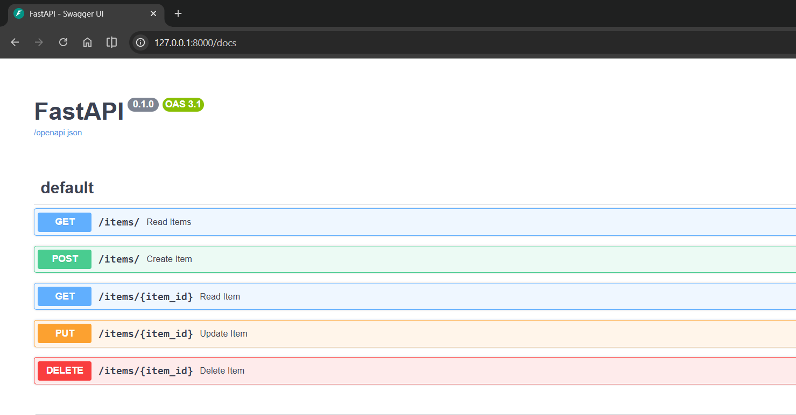
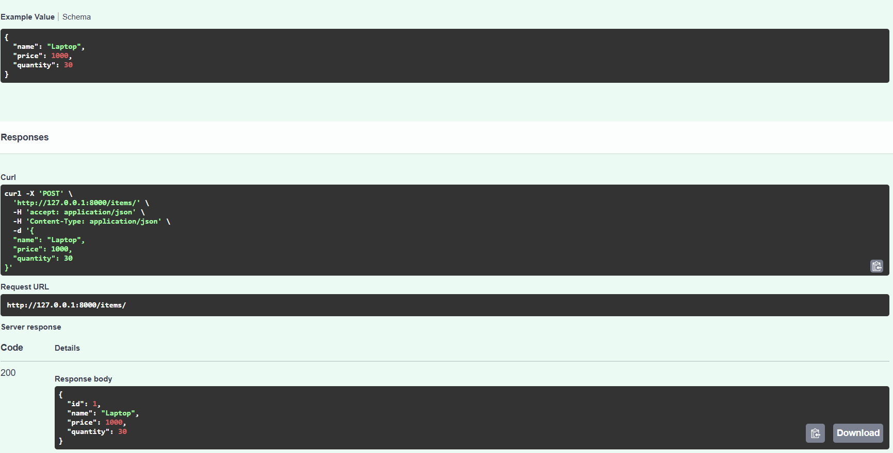
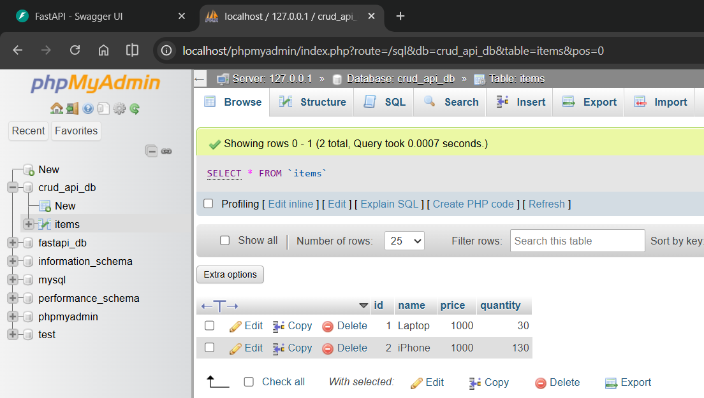
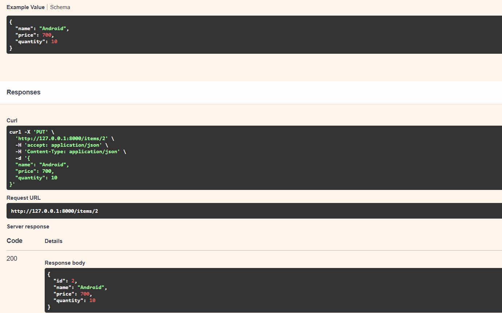
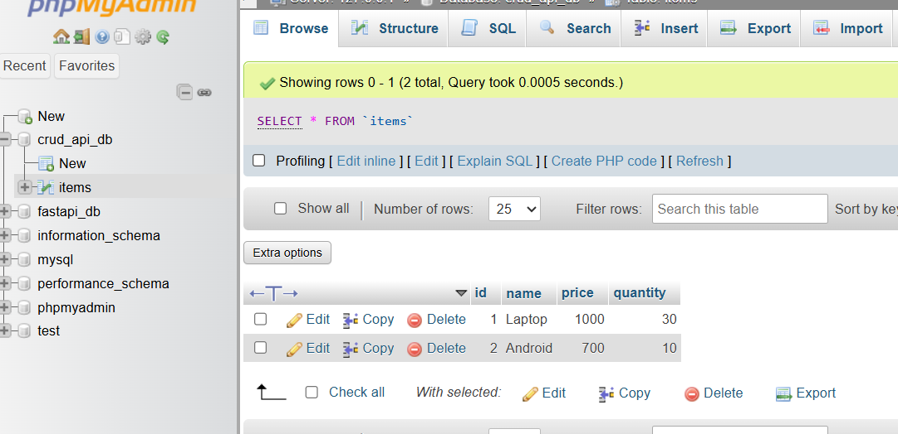
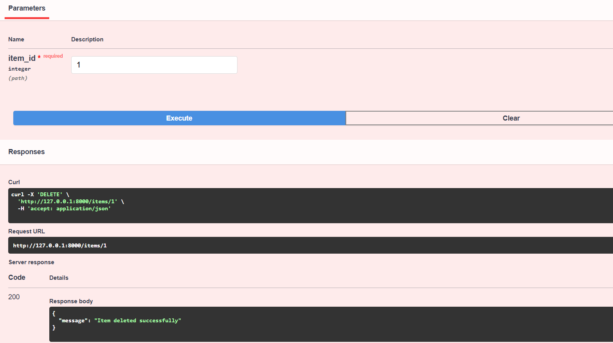
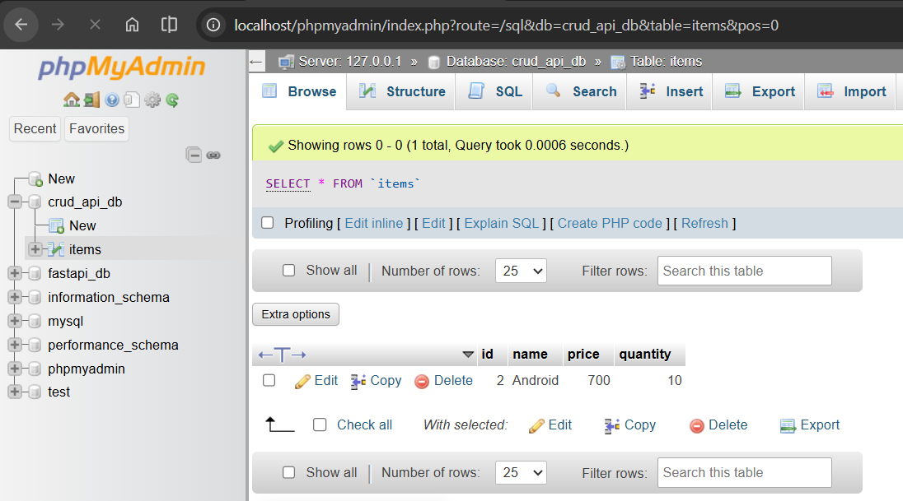

# Building a Complete CRUD API with FastAPI and MySQL

## What You'll Learn

In this tutorial, we're building a real-world REST API that can create, read, update, and delete items from a MySQL database. It's the exact same pattern used by companies like Uber, Netflix, and Instagram. Don't worry if that sounds intimidating – we'll take it step by step!

**CRUD** means:
- **Create** (POST): Add new data
- **Read** (GET): Fetch existing data
- **Update** (PUT): Modify data
- **Delete** (DELETE): Remove data

By the end, you'll have a working API with all four operations, fully documented, and ready to test!

## Before You Start

Make sure you have these installed:
- MySQL Server (can use XAMPP which includes MySQL)
- Python packages: `pip install fastapi uvicorn sqlalchemy pymysql`

## Quick Start in 3 Steps

**Step 1: Create the database**
```bash
mysql -u root -p
```
Then copy-paste this:
```sql
CREATE DATABASE crud_api_db;
```
Press `Ctrl+D` to exit.

**Step 2: Go to the project folder and run**
```bash
cd "07-CRUD-API"
python app.py
```

**Step 3: Open your browser**
Go to: http://127.0.0.1:8000/docs

That's it! You'll see an interactive interface to test all the endpoints.



---

## How It Works Under the Hood

Think of our API like a restaurant manager. The manager (FastAPI) takes orders (requests), talks to the kitchen (database), and gives back food (responses). Let's see how each file plays a role.

### File 1: `db.py` - Your Restaurant Kitchen

This file sets up the connection to MySQL. Here's what it does:

```python
import os
from sqlalchemy import create_engine
from sqlalchemy.orm import DeclarativeBase, sessionmaker

# MySQL Connection Settings (can be changed with environment variables)
MYSQL_USER = os.getenv("MYSQL_USER", "root")
MYSQL_PASSWORD = os.getenv("MYSQL_PASSWORD", "")
MYSQL_HOST = os.getenv("MYSQL_HOST", "localhost")
MYSQL_PORT = os.getenv("MYSQL_PORT", "3306")
MYSQL_DB = os.getenv("MYSQL_DB", "crud_api_db")

# Build the connection string
DATABASE_URL = f"mysql+pymysql://{MYSQL_USER}:{MYSQL_PASSWORD}@{MYSQL_HOST}:{MYSQL_PORT}/{MYSQL_DB}"

# Create the engine (this is like opening a door to the database)
engine = create_engine(DATABASE_URL, echo=True)

# Base class for all database models
class Base(DeclarativeBase):
    pass

# SessionLocal factory (think of it as a waiter that brings orders to the kitchen)
SessionLocal = sessionmaker(bind=engine, autoflush=False)
```

**What's happening?**
- We read credentials from environment variables (or use defaults: `root` user, empty password, `localhost:3306`)
- We build a URL like: `mysql+pymysql://root:@localhost:3306/crud_api_db`
- `pymysql` is the Python driver that talks to MySQL
- `SessionLocal` creates a new "conversation" with the database every time we need it

**Want to use different credentials?** Just set these before running:
```bash
# Windows
set MYSQL_USER=admin
set MYSQL_PASSWORD=secret123

# Linux/Mac
export MYSQL_USER=admin
export MYSQL_PASSWORD=secret123
```

### File 2: `models.py` - The Menu Items

This file describes what data we're storing. Let's create an inventory system for a tech shop:

```python
from sqlalchemy import String, Integer, Float
from sqlalchemy.orm import Mapped, mapped_column
from db import Base

class Item(Base):
    __tablename__ = "items"

    id: Mapped[int] = mapped_column(primary_key=True, index=True)
    name: Mapped[str] = mapped_column(String(100), index=True)
    price: Mapped[float] = mapped_column(Float)
    quantity: Mapped[int] = mapped_column(Integer, default=0)
```

**Breaking this down:**
- `__tablename__ = "items"`: Create a table called "items" in the database
- `id`: Unique identifier (automatically increments 1, 2, 3...)
- `name`: Item name (max 100 characters)
- `price`: Cost of the item
- `quantity`: How many we have in stock (starts at 0 if not specified)

This is the modern SQLAlchemy 2.0+ way. It's cleaner and has better type hints!

### File 3: `app.py` - The Restaurant Manager

This is where all the magic happens. The FastAPI app receives requests, talks to the database, and sends back responses.

```python
from fastapi import FastAPI, Depends, HTTPException
from sqlalchemy.orm import Session
from sqlalchemy import select
from pydantic import BaseModel
from db import SessionLocal, engine, Base
from models import Item

# Create tables when the app starts
Base.metadata.create_all(bind=engine)

# Define what data users can send (for creating/updating items)
class ItemCreate(BaseModel):
    name: str
    price: float
    quantity: float

# Define what data we send back (same as ItemCreate, but with the auto-generated ID)
class ItemResponse(BaseModel):
    id: int
    name: str
    price: float
    quantity: float

# Get database session dependency
def get_db():
    db = SessionLocal()
    try:
        yield db
    finally:
        db.close()

app = FastAPI()
```

**What's this doing?**
- `ItemCreate` and `ItemResponse` are like forms. One is for what users give us, one is for what we give back.
- `get_db()` is a helper function that FastAPI will call automatically whenever an endpoint needs database access.
- It opens a connection, lets the endpoint use it, then closes it safely.

---

## Creating Items (POST)

Let's add the ability to create new items. Users will send JSON like this:

```json
{
  "name": "Laptop",
  "price": 1000,
  "quantity": 30
}
```

And our code will save it to the database:

```python
@app.post("/items/", response_model=ItemResponse)
def create_item(item: ItemCreate, db: Session = Depends(get_db)):
    """Create a new item in the inventory"""
    # Convert the Pydantic model to a database model
    db_item = Item(name=item.name, price=item.price, quantity=item.quantity)
    
    # Add to database (not saved yet)
    db.add(db_item)
    
    # Actually save it
    db.commit()
    
    # Refresh to get the auto-generated ID
    db.refresh(db_item)
    
    return db_item
```

**Flow:** User sends → FastAPI validates with ItemCreate → Database saves → We get back the ID → Return response

Here's what it looks like in action. This is creating a Laptop for $1000:



And here's what appears in your XAMPP MySQL database after creation:



See the `id: 1` automatically created? That's the database doing its job!

---

## Reading Items (GET)

Now let's fetch items from the database. We'll have two endpoints: one to get ALL items, and one to get a specific item by ID.

### Get All Items

```python
@app.get("/items/", response_model=list[ItemResponse])
def read_all_items(db: Session = Depends(get_db)):
    """Get all items in the inventory"""
    query = select(Item)
    items = db.execute(query).scalars().all()
    return items
```

**How it works:**
- `select(Item)` builds the SQL query: `SELECT * FROM items`
- `.scalars()` extracts just the Item objects (no extra database metadata)
- `.all()` gets all results
- Return the list of items

### Get a Specific Item

```python
@app.get("/items/{item_id}", response_model=ItemResponse)
def read_item(item_id: int, db: Session = Depends(get_db)):
    """Get a single item by its ID"""
    db_item = db.query(Item).filter(Item.id == item_id).first()
    if db_item is None:
        raise HTTPException(status_code=404, detail="Item not found")
    return db_item
```

**This does:**
- Takes the item ID from the URL (e.g., `/items/1`)
- Searches the database for it
- If found, returns it
- If not found, returns a 404 error

---

## Updating Items (PUT)

Want to change the price or quantity? Here's how:

```python
@app.put("/items/{item_id}", response_model=ItemResponse)
def update_item(item_id: int, item: ItemCreate, db: Session = Depends(get_db)):
    """Update an existing item"""
    # Find the item
    db_item = db.query(Item).filter(Item.id == item_id).first()
    if db_item is None:
        raise HTTPException(status_code=404, detail="Item not found")
    
    # Change the fields
    db_item.name = item.name
    db_item.price = item.price
    db_item.quantity = item.quantity
    
    # Save the changes
    db.commit()
    db.refresh(db_item)
    
    return db_item
```

Here's the update in action – changing the item to "Android" with $700 price:



And look at the database after the update:



The name changed from "iPhone" to "Android" and the price became $700. Perfect!

---

## Deleting Items (DELETE)

When you need to remove an item:

```python
@app.delete("/items/{item_id}")
def delete_item(item_id: int, db: Session = Depends(get_db)):
    """Delete an item from the inventory"""
    # Find the item
    db_item = db.query(Item).filter(Item.id == item_id).first()
    if db_item is None:
        raise HTTPException(status_code=404, detail="Item not found")
    
    # Delete it
    db.delete(db_item)
    db.commit()
    
    return {"message": "Item deleted successfully"}
```

Here's deleting an item:



And the database after deletion:



Notice the item is gone! The database is now clean.

---

## Testing Everything Yourself

You don't need curl or Postman. FastAPI gives you an interactive API documentation page at: http://127.0.0.1:8000/docs

Just click on each endpoint, hit "Try it out", enter your data, and click "Execute". It's super intuitive!

The endpoints you can test:
- **POST /items/** - Create a new item
- **GET /items/** - Get all items
- **GET /items/{id}** - Get one item
- **PUT /items/{id}** - Update an item
- **DELETE /items/{id}** - Delete an item

---

## Key Concepts Explained

**SQLAlchemy ORM** (Object-Relational Mapping) is like a translator. Instead of writing raw SQL:
```sql
SELECT * FROM items WHERE id = 1;
```

You write Python:
```python
item = db.query(Item).filter(Item.id == 1).first()
```

It's more readable, safer, and easier to maintain!

**Pydantic** validates data. If someone tries to send invalid data (like a string for price), Pydantic catches it and returns a clear error before it reaches your database.

**Dependency Injection** (the `db: Session = Depends(get_db)` part) is FastAPI's way of automatically managing resources. You don't manually open/close database connections – FastAPI does it for you.

---
