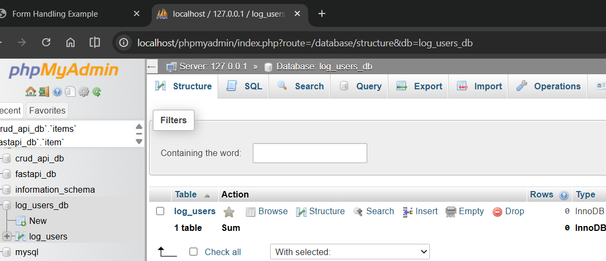
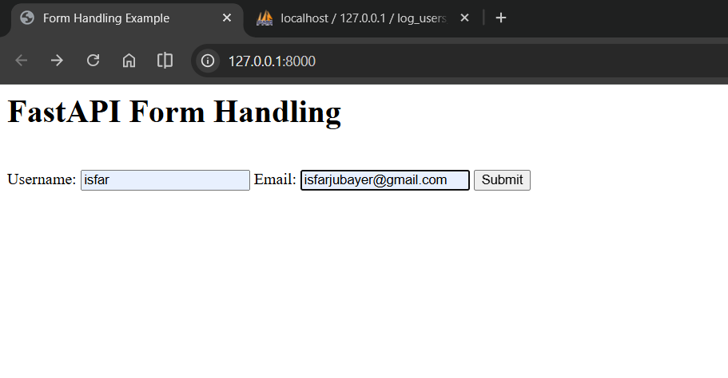
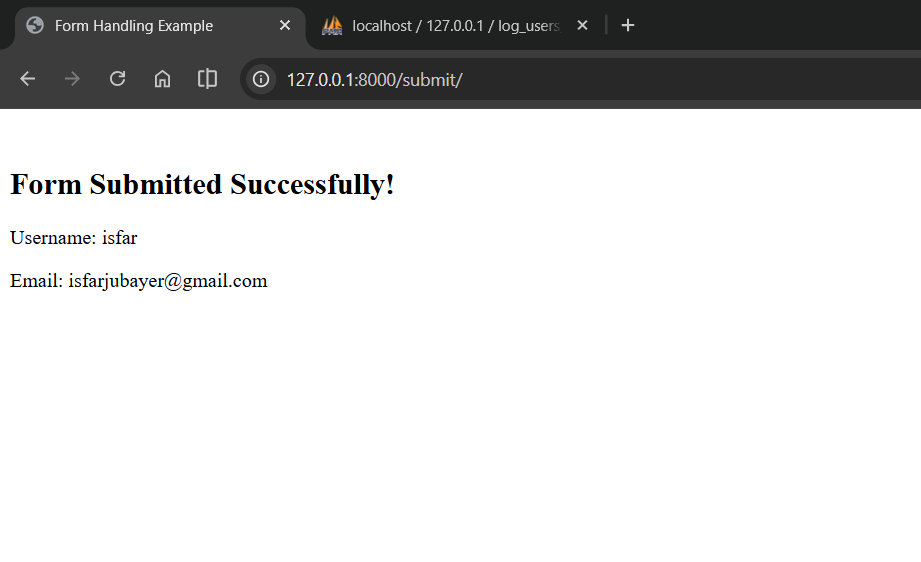
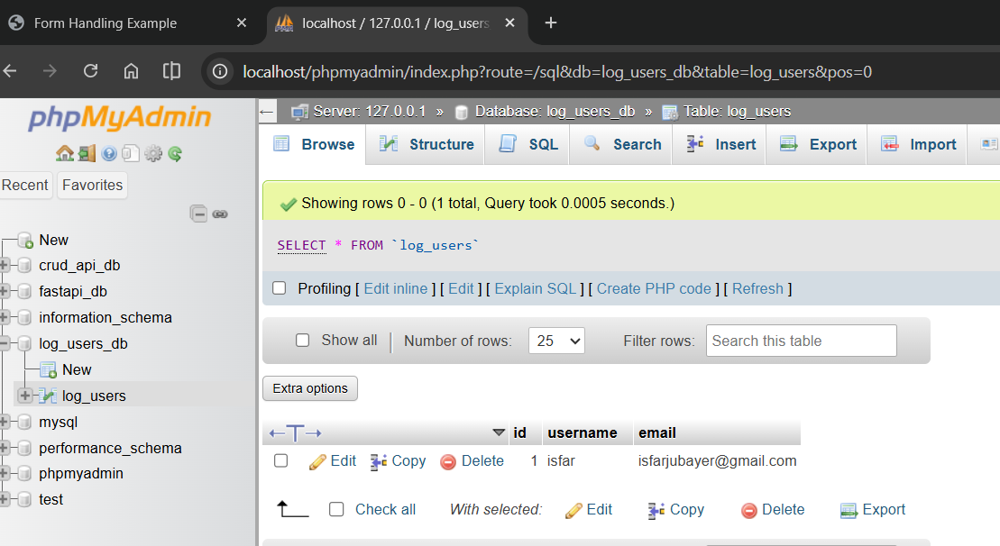

# Form Handling in FastAPI with Database Integration

## Quick Start

**Install packages:**

```bash
pip install fastapi uvicorn jinja2 python-multipart sqlalchemy pymysql
```

**Create the database:**

```bash
mysql -u root -p
```

Then copy-paste:

```sql
CREATE DATABASE form_handler_db;
```

Press `Ctrl+D` to exit.

**Run the app:**

```bash
cd "08-Form-Handler"
python app.py
```

**Open your browser:**
Go to: http://127.0.0.1:8000

---

## How It All Works Together

Think of a form like a restaurant order system:

1. **Customer** (user) sees the form
2. **Waiter** (form) collects their order
3. **Kitchen** (FastAPI backend) processes the order
4. **Receipt** (database) saves the order
5. **Confirmation** (success page) shows it worked

Let's build this step by step.

---

## Part 1: Setting Up the Database

First, we need a place to **store** the form submissions. Here's `db.py`:

```python
import os
from sqlalchemy import create_engine, String
from sqlalchemy.orm import DeclarativeBase, sessionmaker, Session, Mapped, mapped_column

# MySQL Connection
MYSQL_USER = os.getenv("MYSQL_USER", "root")
MYSQL_PASSWORD = os.getenv("MYSQL_PASSWORD", "")
MYSQL_HOST = os.getenv("MYSQL_HOST", "localhost")
MYSQL_PORT = os.getenv("MYSQL_PORT", "3306")
MYSQL_DB = os.getenv("MYSQL_DB", "form_handler_db")

DATABASE_URL = f"mysql+pymysql://{MYSQL_USER}:{MYSQL_PASSWORD}@{MYSQL_HOST}:{MYSQL_PORT}/{MYSQL_DB}"
engine = create_engine(DATABASE_URL, echo=True)

class Base(DeclarativeBase):
    pass

SessionLocal = sessionmaker(bind=engine, autoflush=False)

class LogUser(Base):
    __tablename__ = "users"

    id: Mapped[int] = mapped_column(primary_key=True, index=True)
    username: Mapped[str] = mapped_column(String(100), index=True)
    email: Mapped[str] = mapped_column(String(100), index=True)

def create_db_and_tables():
    Base.metadata.create_all(bind=engine)
```

**What's happening:**

- We connect to MySQL using pymysql
- We create a `LogUser` table to store form submissions
- `create_db_and_tables()` creates the table when the app starts

Here's the database being created:



---

## Part 2: Building the FastAPI Backend

Now let's create the endpoints that handle the form. Here's `app.py`:

```python
from fastapi import FastAPI, Form, Request, Depends
from fastapi.responses import HTMLResponse
from fastapi.templating import Jinja2Templates
from sqlalchemy.orm import Session
from db import create_db_and_tables, SessionLocal, LogUser

# Setup
create_db_and_tables()
app = FastAPI()
templates = Jinja2Templates(directory="templates")

def get_db():
    """Dependency: Get database session"""
    db = SessionLocal()
    try:
        yield db
    finally:
        db.close()

# Route 1: Show the form
@app.get("/", response_class=HTMLResponse)
async def index(request: Request):
    return templates.TemplateResponse(
        request=request,
        name="index.html",
        context={"name": "FastAPI Form Handling"}
    )

# Route 2: Handle form submission
@app.post("/submit/")
async def submit_form(
    request: Request,
    username: str = Form(...),
    email: str = Form(...),
    db: Session = Depends(get_db)
):
    # Save to database
    log_user = LogUser(username=username, email=email)
    db.add(log_user)
    db.commit()
    db.refresh(log_user)

    # Return success page
    return templates.TemplateResponse(
        request=request,
        name="output.html",
        context={"username": username, "email": email}
    )
```

**Key concepts:**

### Form Routing

FastAPI uses **different HTTP methods** for different operations:

- `@app.get("/")` - Shows the form (GET request) - retrieve data
- `@app.post("/submit/")` - Processes the form (POST request) - submit data

This is important! GET is for retrieving (safe, idempotent), POST is for creating (changes state).

### Form Validation with `Form(...)`

```python
username: str = Form(...)
email: str = Form(...)
```

Here's what happens:

- FastAPI looks in the **request body** for fields with these names
- `...` (Ellipsis) means "this field is **required**" - if missing, FastAPI returns error
- Names must match HTML `<input name="username">` - case-sensitive!
- FastAPI automatically validates types (will reject if not string)

### Database Integration

```python
db: Session = Depends(get_db)
```

This uses **dependency injection**:

- `Depends(get_db)` tells FastAPI: "call get_db() for me and pass the result"
- `get_db()` opens a database session
- We save the form data to database:
  ```python
  log_user = LogUser(username=username, email=email)
  db.add(log_user)  # Mark for insertion
  db.commit()       # Actually save to database
  ```
- FastAPI automatically closes the session when done

---

## Part 3: HTML Form with Jinja2

Here's `templates/index.html`:

```html
<html>
  <head>
    <title>Form Handling Example</title>
  </head>
  <body>
    <h1>{{name}}</h1>
    <br />
    
    <form action="/submit/" method="post">
      <label for="username">Username:</label>
      <input type="text" id="username" name="username" />
      <label for="email">Email:</label>
      <input type="email" id="email" name="email" />
      <button type="submit">Submit</button>
    </form>
    
  </body>
</html>
```

**Understanding the form:**

1. **Jinja2 Variable:** `{{ name }}` displays the value from context
2. **Template Block:** `...` creates a reusable section that child templates can override
3. **Form Routing:** `action="/submit/"` tells the form to send data to the `/submit/` POST endpoint
4. **Form Method:** `method="post"` sends data securely in the request body (not in URL)
5. **Field Names:** `name="username"` and `name="email"` must exactly match the Python parameter names
6. **Input Types:** `type="text"` for username, `type="email"` for email validation

Here's what the form looks like when you open it:



---

## Part 4: Template Inheritance with Jinja2

Here's `templates/output.html`:

```html
 
<h2>Form Submitted Successfully!</h2>
<p>Username: {{ username }}</p>
<p>Email: {{ email }}</p>

```

**Template Inheritance - Why it's powerful:**

Without inheritance, you'd have to duplicate HTML in every page:

```html
<!-- Duplicate in every template -->
<html>
  <head>
    <title>...</title>
    <style>
      ...styles...
    </style>
  </head>
  <body>
    <!-- Page specific content -->
  </body>
</html>
```

With inheritance, **write once, reuse everywhere**:

- `` - Start with the base template (inherit everything)
- `...` - Override only the body section
- Everything else (styling, layout, title) stays the same!

**How it works:**

1. Jinja2 loads `index.html` (the base)
2. It finds ``
3. It replaces that block with content from `output.html`
4. Result: styled page with success message

**Data Display:**

- `{{ username }}` and `{{ email }}` are Jinja2 variables
- They come from the `context` dict passed in FastAPI: `context={"username": username, "email": email}`

Here's the success page after submission:



And here's the database storing the submission:



The form data is safely stored in MySQL and can be viewed in XAMPP!

---

## Complete Request/Response Flow

### Step 1: User loads `/`

```
User opens browser to http://127.0.0.1:8000
↓
Browser sends: GET /
↓
FastAPI routes to index() function
↓
index() renders index.html with context {"name": "..."}
↓
Jinja2 replaces {{ name }} with "FastAPI Form Handling"
↓
Browser receives and displays the form
```

### Step 2: User fills and submits

```
User types:
  Username: john_doe
  Email: john@example.com
↓
User clicks Submit button
↓
Form automatically sends: POST /submit/ with form data in body
  username=john_doe
  email=john@example.com
```

### Step 3: FastAPI processes

```
POST /submit/ received
↓
FastAPI parameter validation:
  username: str = Form(...) ✓ (got "john_doe")
  email: str = Form(...) ✓ (got "john@example.com")
↓
get_db() provides database session
↓
Create LogUser object with data
↓
db.add() and db.commit() save to MySQL
↓
submit_form() returns output.html with context
```

### Step 4: Success page shows

```
output.html extends index.html
↓
 is replaced with success message
↓
Jinja2 replaces {{ username }} with "john_doe"
Jinja2 replaces {{ email }} with "john@example.com"
↓
Browser receives and displays success page
```

---
