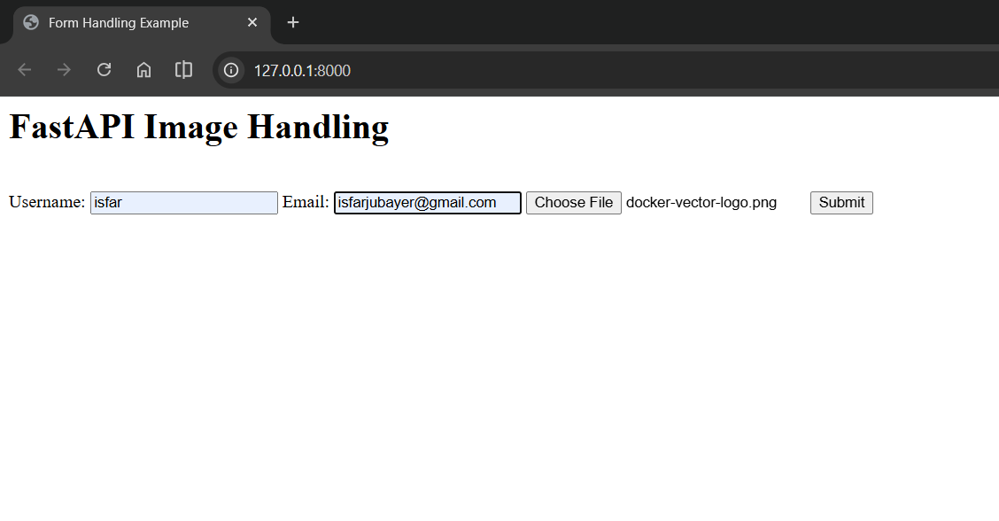

# Image Upload with FastAPI

## What This Does

This is a simple web form that lets users upload images. When they fill in their username, email, and select an image, the form:

1. Saves the image file to the server
2. Shows a preview of the uploaded image
3. Stores the file in a folder

---

## How to Run

Install packages:

```bash
pip install fastapi uvicorn python-multipart
```

Start the app:

```bash
python app.py
```

Open your browser:

```
http://127.0.0.1:8000
```

---

## Project Files

- `app.py` - The main FastAPI application with routes
- `templates/index.html` - The upload form page
- `templates/output.html` - The success page showing the uploaded image
- `static/uploads/` - Where uploaded images are saved

---

## How It Works

### Step 1: User sees the form

When you visit the home page (`/`), you get a simple form:



The form has three fields:

- Username (text input)
- Email (email input)
- Image file (file picker)

### Step 2: User submits

When the user fills in the form and clicks submit, the form sends a POST request to `/submit/` with all the data.

```python
@app.post("/submit/")
async def submit_form(
    request: Request,
    username: str = Form(...),
    email: str = Form(...),
    file: UploadFile = File(...)
):
```

FastAPI receives:

- `username` and `email` from the form fields
- `file` as the uploaded image file

The `Form(...)` and `File(...)` mean these fields are required.

### Step 3: Save the file

The uploaded file is saved to the `static/uploads/` folder:

```python
file_location = os.path.join(UPLOAD_FOLDER, file.filename)
with open(file_location, "wb") as buffer:
    shutil.copyfileobj(file.file, buffer)
```

Here's what it looks like in the file system:


The files are safely stored and can be viewed in the folder.

### Step 4: Show the result

After saving, FastAPI creates a URL path to the image and displays it:

```python
image_path = f"{UPLOAD_URL}{filename}"
```

The browser then displays the uploaded image:


The image is accessible because FastAPI mounts the `static` folder at `/static`:

```python
app.mount("/static", StaticFiles(directory="static"), name="static")
```

This means any file in the `static` folder can be accessed via URL. So a file saved at `static/uploads/photo.png` becomes accessible at `/static/uploads/photo.png` in the browser.

---

## Understanding the Code

### Two Upload Paths

```python
UPLOAD_FOLDER = "static/uploads/"  # For saving files on disk
UPLOAD_URL = "/static/uploads/"     # For showing files in browser
```

These look similar but do different things:

- `static/uploads/` - Real file system path where files are stored
- `/static/uploads/` - URL path that the browser uses to retrieve files

When you save a file to `static/uploads/photo.png`, the browser can retrieve it by visiting `/static/uploads/photo.png`.

### File Upload Parameters

```python
file: UploadFile = File(...)
```

`UploadFile` handles the uploaded file. It gives you:

- `file.filename` - The original filename
- `file.file` - The file data you can save
- `file.content_type` - The file type (image/png, etc.)

### Static Files Mount

```python
app.mount("/static", StaticFiles(directory="static"), name="static")
```

This tells FastAPI: "When someone requests `/static/something`, give them the file from the `static` folder."

Without this line, uploaded images wouldn't be accessible.

### Saving Binary Data

```python
with open(file_location, "wb") as buffer:
    shutil.copyfileobj(file.file, buffer)
```

This saves the file in binary mode (`wb` means write binary). This is important for images because they're binary data, not text.

`shutil.copyfileobj()` copies the file efficiently by streaming it, which is good for large files.

---

## Templates

### index.html - The Form

The form page uses a simple HTML form with:

```html
<form action="/submit/" method="post" enctype="multipart/form-data">
  <input type="text" name="username" />
  <input type="email" name="email" />
  <input type="file" name="file" />
  <button type="submit">Upload</button>
</form>
```

Key points:

- `action="/submit/"` - sends data to the `/submit/` endpoint
- `method="post"` - uses POST request (required for file uploads)
- `enctype="multipart/form-data"` - tells browser to send file data in the right format
- `type="file"` - creates the file picker button
- Field names must match the Python parameters (username, email, file)

### output.html - The Success Page

The success page extends the base template and shows the image:

```html
 
<h2>Upload Successful!</h2>
<p>Username: {{ username }}</p>
<p>Email: {{ email }}</p>


```

It displays:

- The form data (username and email)
- A preview of the uploaded image

---

## Request Flow

1. User opens browser to `/`
2. FastAPI returns the form page (index.html)
3. User fills username, email, picks an image
4. User clicks Submit
5. Browser sends POST to `/submit/` with form data and image file
6. FastAPI saves the file to `static/uploads/filename`
7. FastAPI calculates the image URL `/static/uploads/filename`
8. FastAPI returns the success page (output.html) with the image URL
9. Browser renders the image using the URL

---

## File Structure

```
10-Image-Upload-Handler/
├── app.py                    # Main application
├── static/
│   ├── uploads/              # Where images are saved
│   └── files/                # Other static files
├── templates/
│   ├── index.html            # Upload form
│   └── output.html           # Success page with preview
└── README.md
```

---
